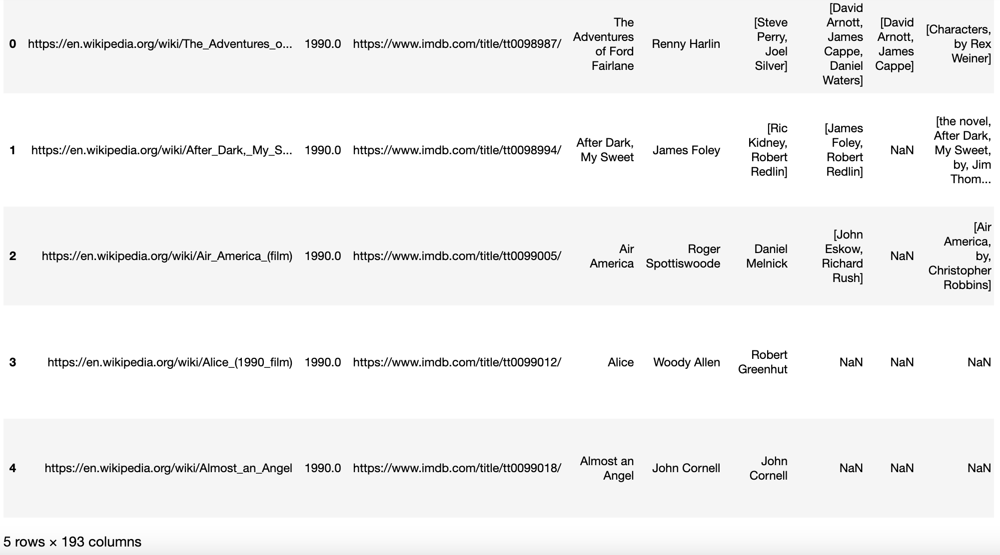
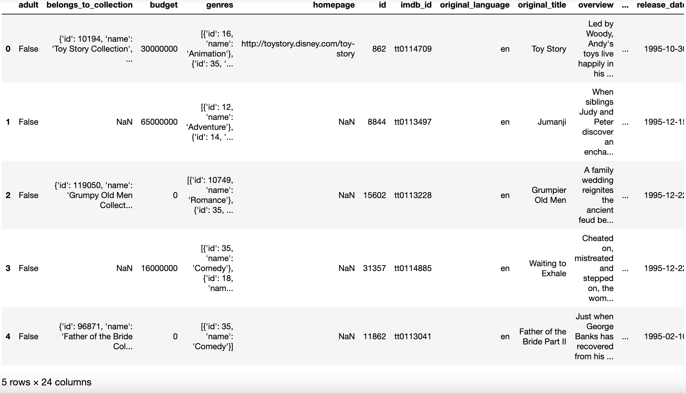
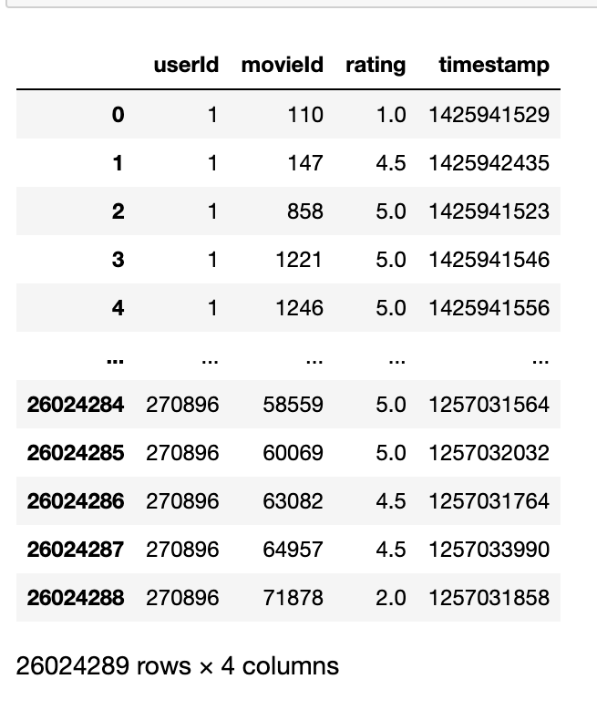
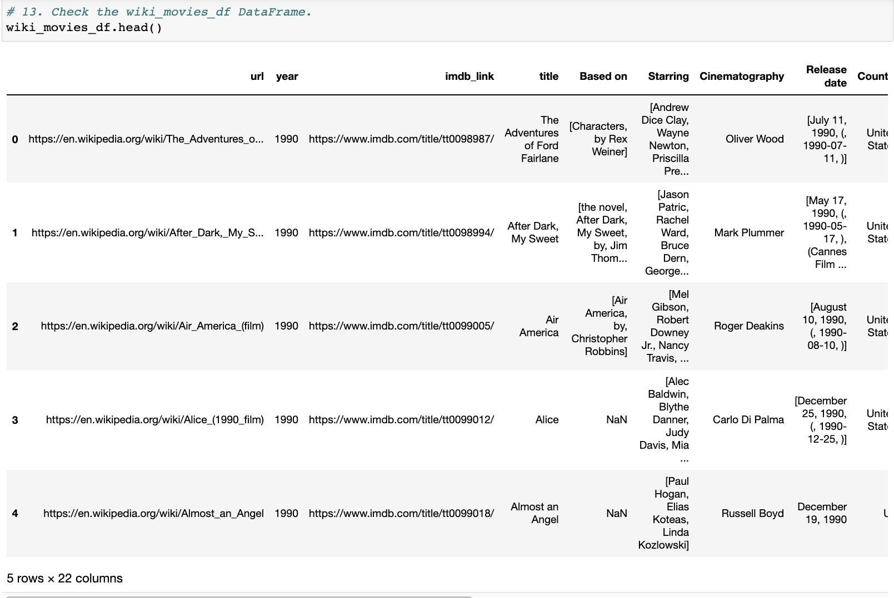
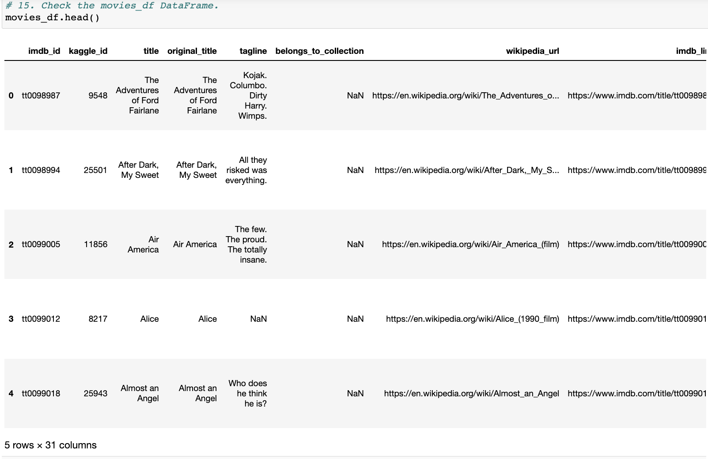
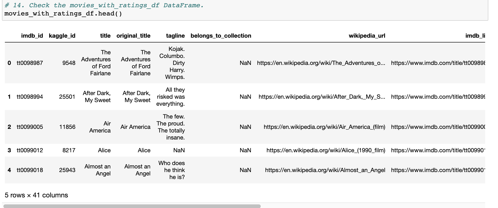
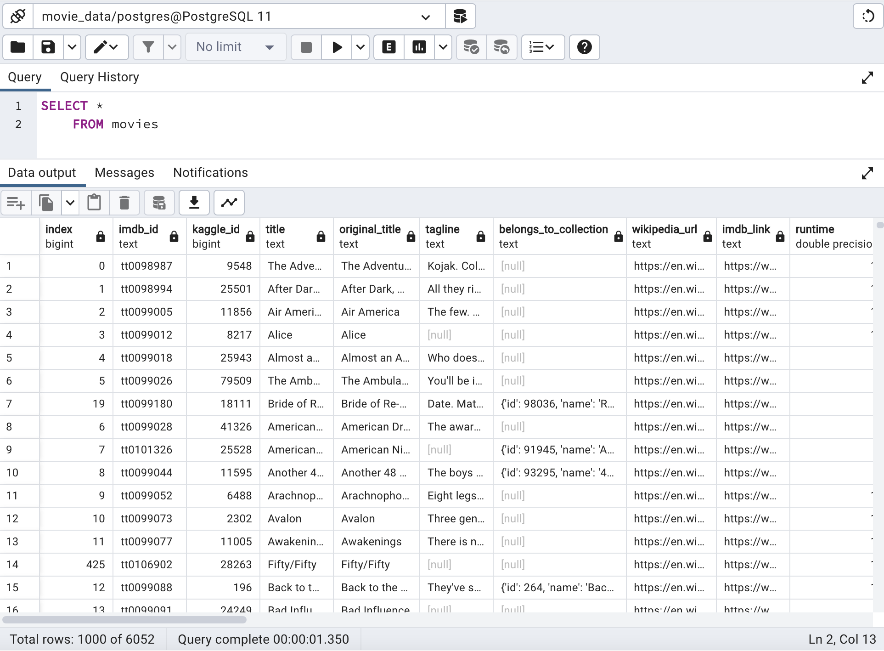
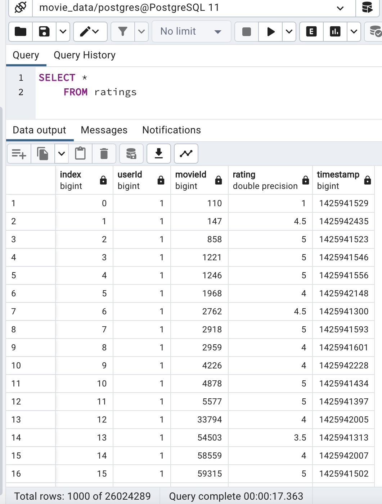

# Movies-ETL

## Overview

The video team of a major movie and TV show streaming company has asked to provide a clean data set of movie data so as to predict the popular pictures. An automated data pipeline that takes in data, performs the appropriate transformations, and loads the data into database needs to be created. The tasks to be done are as detailed below:
- Extract data from three data sources: 
  - Wikipedia for all movies released since 1990 (JSON format).
  - Kaggle metadata (CSV format).
  - Ratings from  MovieLand’s website (CSV format).
- Transform data from both sources into one clean dataset using below iterative process.
  - Inspect data and identify a problem.
  - Plan to fix the problem.
  - Execute the repair and go on to inspect another problem.
- Load the data set into Movie database

## Resources

- CSV and flat files from source websites
- Anaconda3-2022.05
- Conda 4.14.0
- Jupyter Notebook 6.4.8
- ipykernel 6.9.1
- Python 3.7.13
- Pandas 1.3.5
- PostgreSQL and pgAdmin
- SQLalchemy 1.4.32

## Results
- The three data sources are extracted using Python and Pandas. The extracted data shows that Wiki movies has 193 columns in the data frame while Kaggle movies has 24 columns ad Kaggle ratings has 4 columns. The details are shown in the below images:
<table>
  <th>Wiki Movies</th>
  <th>Kaggle Movies</th>
  <tr>
    <td></td>
    <td></td>
  </tr>
  <tr>
    <td colspan="2" align="center">Kaggle Ratings</td>
  </tr>
  <tr>
    <td colspan="2" align="center"></td>
  </tr>
</table>

- The extracted data is cleaned and parsed using Regular Expressions. 
  - Upon cleaning wiki movies, the column count reduced from 193 to 23 columns.
  - The merged data set of wiki movies and Kaggle movies has 31 columns.
  - The merged data of wiki and Kaggle movies and Kaggle ratings has 41 columns.
 <table>
  <th>Transformed Wiki Movies</th>
  <th>Merged Wiki and Kaggle Movies</th>
  <tr>
    <td></td>
    <td></td>
  </tr>
  <tr>
    <td colspan='2' align='center'> Merged Movies and Ratings</td>
  </tr>
  <tr>
    <td colspan='2' align='center'></td>
  </tr>
</table>

- The transformed data is then loaded to PostgreSQL database. The merged movie ratings data has 6,052 rows and ratings table has 26,024,289 rows.
<table>
  <tr>
    <td></td>
    <td></td>
  </tr>
</table>
